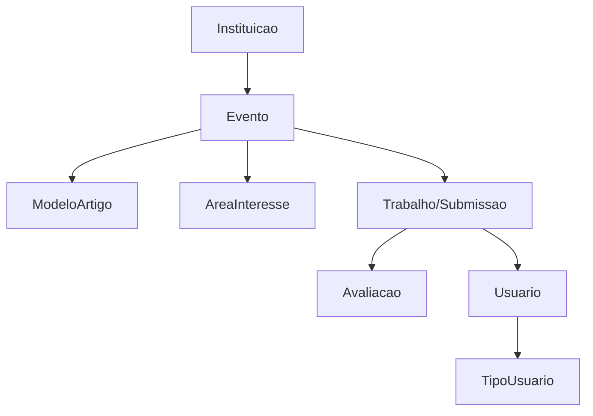

# Revisão
* Projeto de Banco de dados
  
   ↳ Levantamento e análise de requisitos
 
   ↳ Necessidades: funcionais e estruturais
  
  * Modelagem conceitual
    
     ↳ Entidades
    
     ↳ Atributos
    
     ↳ Atributos identificadores ou chaves primárias
    
     ↳ Relacionamentos: associação e herança
    
     ↳ Cardinalidades
      
  * Modelegem lógica
    
     ↳ Atributos estrangeiros ou chave estrangeira
    
     ↳ Quem define é a cardinalidade ("o n puxa")
  
# ✦ Modelagem física
  * Tipos dos atributos
    
  * Restrições
    
  * Atributos
    
  * Duplicidade - automática ao se definir uma chave primária
    
  * Dependência - chave estrangeira
    - delete on: cascade ou restrict

## Exercício
  * Preciso de um sistema web em que se possa gerenciar eventos cientificos, separados por instituições de ensino. 
  * Uma vez que o evento científico é gerado, um coordenador autoriza a submissçao de trabalhos. 
  * Uma submissão de trabalho deve conter: título, autores (que devem estar no sistema), área de onteresse (áreas de interesse são gerenciadas també, pelo sistema), resumo, palavras-chave e o arquivo contendo o artigo. 
  * O sistema deve gerenciar modelos de artigos e que serão associados a um evento. 
    * Um evento tem um coordenador, um título, data de entrega de trabalho, modelo de artigo. 
  * Uma vez que uma submissão de trabalho é cadastrada, o coodernador do evento precisa delegar 2 avaliadores, criando uma avaliação online, em que os avaliadores escrevem um parecer e informam SIM ou Não ao artigo.
  * Ou seja, se ele foi ou não aceito para a publicação.

### Modelo lógico

* Entidades
  - Instituição
  - Evento
  - Trabalho/Submissao
  - Usuário
  - TipodeUsuario → Sempre tentar usar tipode usuário, pois algum dia pode aumentar os tipos de usuario do banco, evita dor de cabeça
                  → Sempre colocar no sistema um membro ADMINISTRADOR, o qual terá acesso a tudo, sem restrições
  - Avaliação
  - AreaDeInteresse
  - ModeloArtigo

### Modelo relacional

